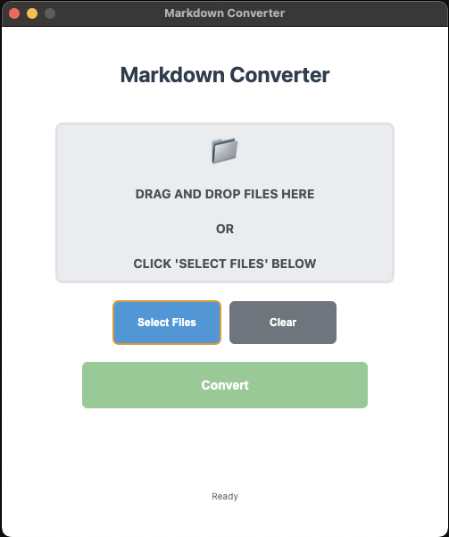

# Markdown Converter



A modern, cross-platform desktop application for converting various file formats to Markdown. Built with Electron and Python, featuring a clean interface with native drag & drop support.


## Features

- 🎯 **Drag & Drop Interface** - Simply drag files into the app or use the file picker
- 📄 **Multiple Format Support** - Convert PDF, DOCX, XLSX, PPTX, TXT, HTML, CSV, JSON, and XML files
- 🖥️ **Cross-Platform** - Works seamlessly on macOS, Windows, and Linux
- ⚡ **Real-time Progress** - Track conversion progress with visual feedback
- 🎨 **Modern UI** - Clean, responsive interface that adapts to your system
- 🔒 **Secure** - Uses Electron's security best practices with context isolation

## Supported File Formats

| Input Format | Extension | Description                        |
| ------------ | --------- | ---------------------------------- |
| PDF          | `.pdf`    | Portable Document Format           |
| Word         | `.docx`   | Microsoft Word documents           |
| Excel        | `.xlsx`   | Microsoft Excel spreadsheets       |
| PowerPoint   | `.pptx`   | Microsoft PowerPoint presentations |
| Text         | `.txt`    | Plain text files                   |
| HTML         | `.html`   | Web pages                          |
| CSV          | `.csv`    | Comma-separated values             |
| JSON         | `.json`   | JavaScript Object Notation         |
| XML          | `.xml`    | Extensible Markup Language         |

## Installation

### Prerequisites

- **Node.js** (v16 or higher) - [Download here](https://nodejs.org/)
- **Python 3** (v3.7 or higher) - [Download here](https://python.org/)

### Setup

1. **Clone the repository**

   ```bash
   git clone <repository-url>
   cd markdown-converter
   ```

2. **Install Node.js dependencies**

   ```bash
   npm install
   ```

3. **Install Python dependencies**
   ```bash
   pip install -r requirements.txt
   ```

## Usage

### Running the Application

```bash
npm start
```

### Development Mode

To run with developer tools enabled:

```bash
npm run dev
```

### How to Convert Files

1. **Launch the application** using `npm start`
2. **Add files** by either:
   - Dragging and dropping files into the designated area
   - Clicking "Select Files" to browse for files
3. **Choose output directory** by clicking "Select Output Directory"
4. **Click "Convert"** to start the conversion process
5. **Monitor progress** through the progress bar and status messages

### Building for Distribution

To create distributable packages:

```bash
npm run build
```

This will create platform-specific installers in the `dist/` folder.

## Project Structure

```
markdown-converter/
├── main.js              # Electron main process
├── preload.js           # Secure IPC bridge
├── renderer.js          # Frontend application logic
├── index.html           # Application UI structure
├── styles.css           # Application styling
├── converter.py         # Python conversion script
├── package.json         # Node.js dependencies and scripts
├── requirements.txt     # Python dependencies
└── README.md           # This file
```

## Technical Details

### Architecture

- **Frontend**: HTML, CSS, JavaScript (Renderer Process)
- **Backend**: Node.js with Electron (Main Process)
- **Conversion Engine**: Python with markitdown library
- **IPC**: Secure communication via Electron's contextBridge

### Security

- Context isolation enabled
- Node integration disabled in renderer
- Secure IPC communication through preload script
- File validation before processing

## Dependencies

### Node.js Dependencies

- `electron` - Desktop application framework
- `electron-builder` - Application packaging

### Python Dependencies

- `markitdown` - File format conversion library

## Troubleshooting

### Common Issues

**Application won't start**

- Ensure Node.js and Python are installed and in your PATH
- Run `npm install` to install dependencies
- Check that Python dependencies are installed: `pip install -r requirements.txt`

**Conversion fails**

- Verify the input file is not corrupted
- Ensure the output directory exists and is writable
- Check that Python is accessible from the command line

**Drag & drop not working**

- This is resolved in the Electron version (previous tkinter version had macOS compatibility issues)
- Ensure you're dropping supported file types

### Getting Help

If you encounter issues:

1. Check the console output when running `npm start`
2. Try running in development mode: `npm run dev`
3. Verify all dependencies are installed correctly

## Development

### Adding New File Formats

To add support for new file formats:

1. Update the file filters in `main.js` (ipcMain handlers)
2. Add the extension to the validation in `renderer.js`
3. Ensure the `markitdown` library supports the format
4. Update the supported formats table in this README

### Customizing the UI

- Modify `styles.css` for visual changes
- Update `index.html` for structural changes
- Edit `renderer.js` for functionality changes

## License

This project is licensed under the MIT License - see the [LICENSE](LICENSE) file for details.

## Acknowledgments

- Built with [Electron](https://electronjs.org/)
- Conversion powered by [markitdown](https://github.com/microsoft/markitdown)
- Icons and styling inspired by modern desktop applications

---

**Note**: This application was migrated from tkinter to Electron to resolve macOS compatibility issues and provide a better cross-platform experience.
